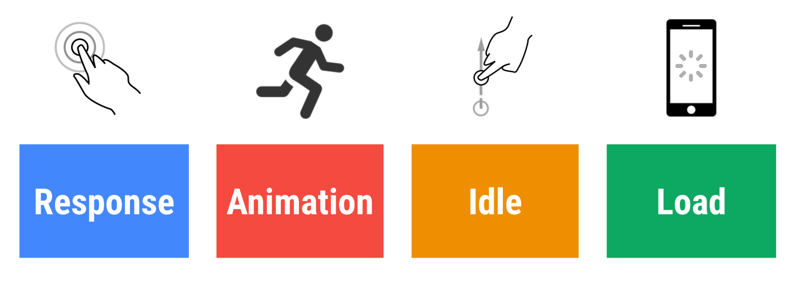
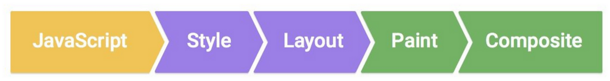
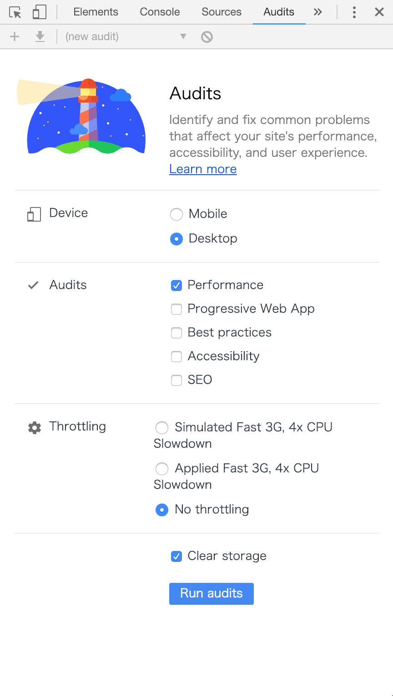
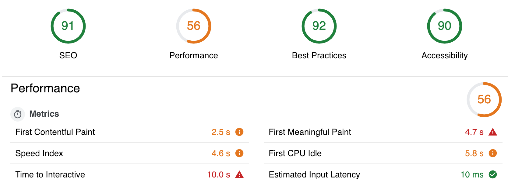
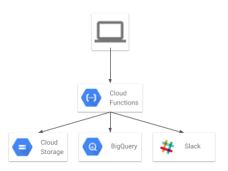
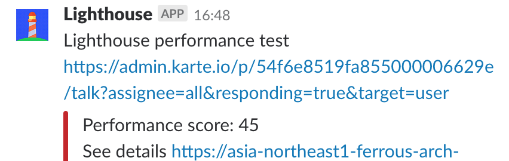
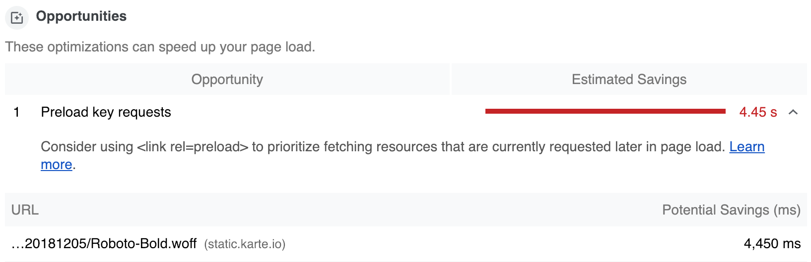
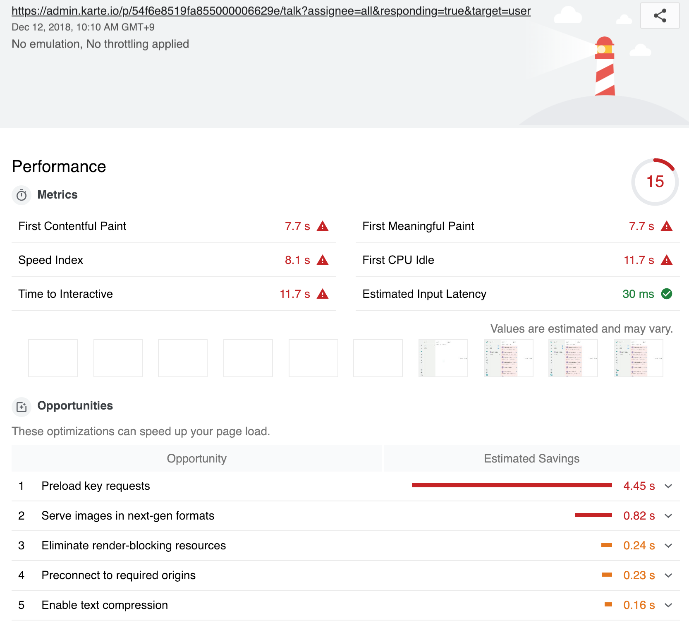
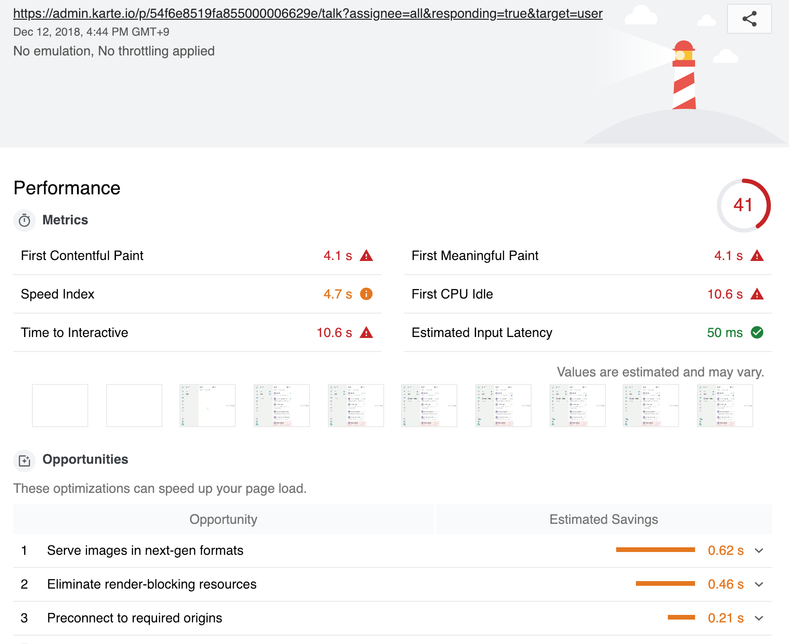

title: 顧客体験を向上させるためのWebサイトのパフォーマンス計測
class: animation-fade
author: algas
tags: performance Lighthouse
layout: true

<!-- This slide will serve as the base layout for all your slides -->
.bottom-bar[
  
]

---

class: impact

# {{title}}
## @algas

---

# 自己紹介

## 株式会社プレイド
Engineer / Hunter  
Performance team  
山内 雅浩 ([@algas](https://github.com/algas))

---

# 今日の発表内容

1. 顧客体験を向上させるためのパフォーマンスの計測の考え方
1. 管理画面のパフォーマンス計測を行うために構築したシステムの概要
1. パフォーマンス計測で見つかった具体的な課題と解決方法

--

PLAID Advent Calendar 2018  
「顧客体験を向上させるためのWebサイトのパフォーマンス計測」  
https://qiita.com/algas/items/f385222580145f01dea2

---

# 顧客にとって有効なパフォーマンス計測

自社のWebサービスの顧客体験(CX)を向上させるには何が必要？

--

魅力的なデザイン？  

--

洗練された画面フロー？  

--

## →それ以前に不満なく動作することが大切

---

# ユーザの体感速度を定量的に観測するには

--
## 画面のないAPIやCLIの速度を測る

単純に応答速度を測れば良い

--
## Webページの体感速度を測る

応答速度≠体感速度

--
## →応答速度だけではないパフォーマンス計測が必要

---

# ユーザ体感に基づくパフォーマンス計測

引用: https://developers.google.com/web/fundamentals/performance/rail

.col-8[

]  

---

# Lighthouse

Webサイトの品質を向上させるための計測ツール
https://developers.google.com/web/tools/lighthouse

## Lighthouseを選んだ理由

1. 対応ブラウザである Google Chrome にデフォルトで組み込まれている
1. 前述の RAIL などの考え方を(ある程度)体現している
1. KARTE でも使っている node.js を使ってカスタマイズできる

---

class: two-columns

# Lighthouseをローカルで試す

Google Chrome で Audits を開いて実行するだけ。

.col-6[

]

.col-6[

]

---

class: two-columns

# パフォーマンス計測システム

.col-6[

]

.col-6[

]

---

class: two-columns

# パフォーマンス計測で見つかった課題例

.col-10[

]

---

class: two-columns

# パフォーマンス改善の結果

.col-6[
Before

]

.col-6[
After

]

---

# 発表のまとめ

Lighthouseを使ってユーザ視点でのWebサイトのパフォーマンスの改善に取り組み、  
実際にパフォーマンスが改善した例をご紹介しました。

今回の発表の元になっているブログは以下で公開しています。
https://qiita.com/algas/items/f385222580145f01dea2

---

class: impact

# 最後に宣伝

## 株式会社プレイドでは一緒に未来を作ってくれる
## エンジニアを募集しています！

https://plaid.co.jp/recruit/engineer.html
